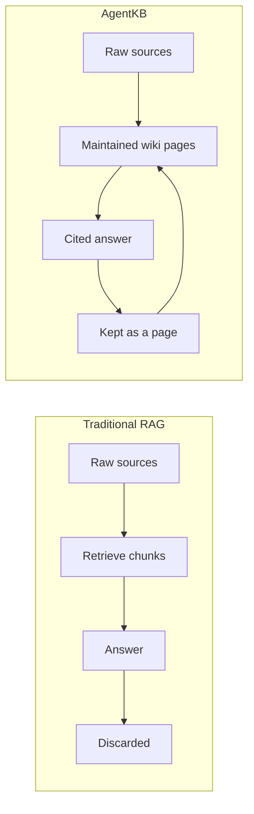
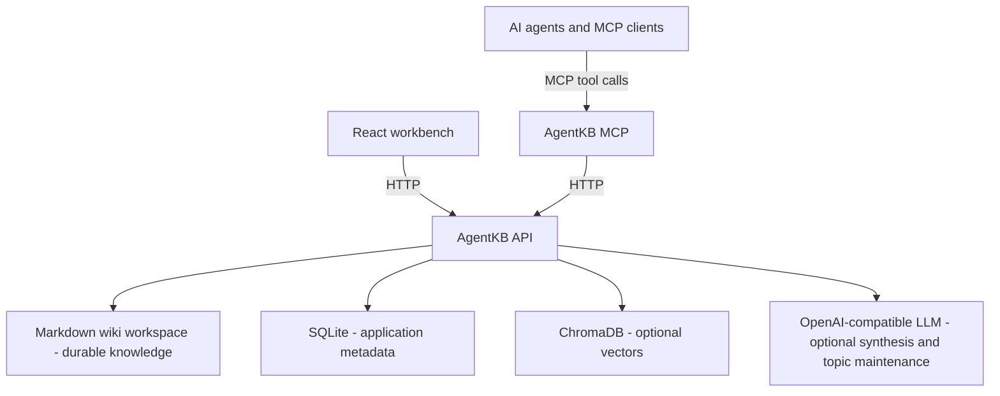
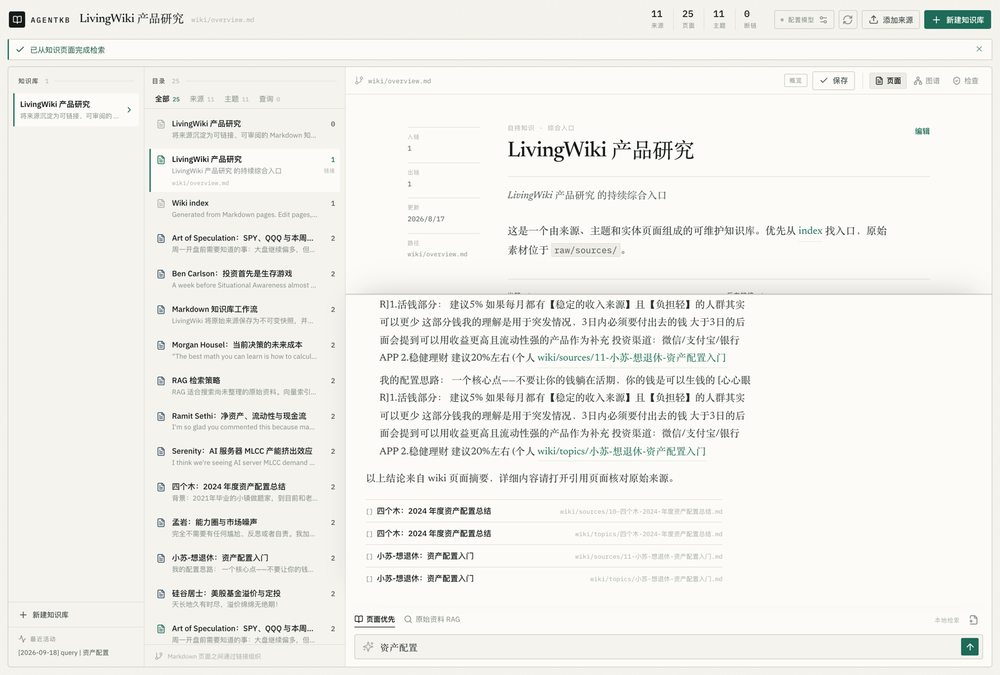
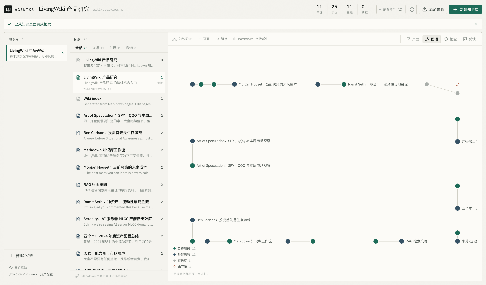
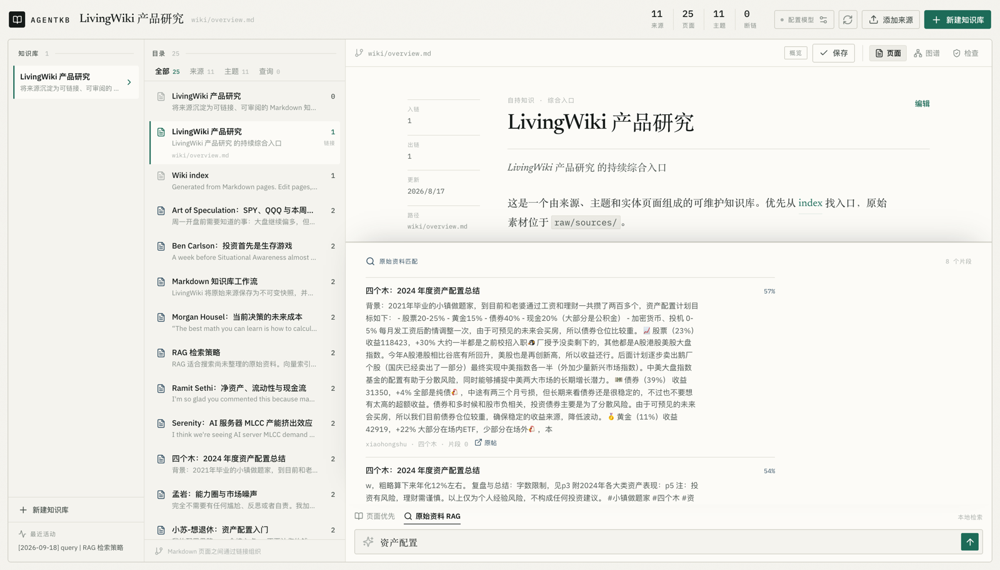

# Agent Knowledge Base (AgentKB)

> A local-first, Git-friendly Markdown knowledge base for AI agents.

**English** · [中文](README_CN.md)

<!-- README.md is the English source; keep README_CN.md in sync when editing. -->

Agent Knowledge Base, abbreviated as AgentKB, turns raw sources into a linked, reviewable, and reusable knowledge base. Each knowledge base is a plain Markdown workspace with immutable source snapshots, maintained pages, an index, and an activity log. A web workbench and MCP server expose the same workflow to people and agents.

AgentKB is currently an alpha knowledge base workbench. Ingest, retrieval, and crystallization all work without a model. An optional OpenAI-compatible layer then does the part a heuristic cannot: it files a new source into the topic page it really belongs to, keeps that page's evolving synthesis current, and writes evidence-bound answers with citations. Page proposals that need human review, streaming synthesis, background ingest queues, and content-level lint are planned next.

## Why AgentKB



The difference is what happens after the answer is written. Ingest compiles sources into maintained pages; a query answers from those pages; and an answer worth keeping is filed back as another page, so the next query starts from more than the last one did.

The Markdown workspace is the long-lived source of truth. SQLite preserves application metadata and ChromaDB is an optional retrieval accelerator, rather than the only place where knowledge exists.

## What Works Today

- Local Markdown workspace per knowledge base.
- Immutable raw source snapshots under `raw/sources/`.
- Source pages, topic pages, `index.md`, and append-only `log.md`.
- Topic pages that accumulate sources and, when a model is configured, an LLM-maintained `## Evolving synthesis` section; routing and the source list stay deterministic.
- React workbench for browsing and editing Markdown pages.
- Three workbench surfaces over the same workspace: the page itself, the link graph derived from `[[wikilinks]]`, and a wiki health check that can create a page for a broken link.
- Optional OpenAI-compatible synthesis for page and raw-source queries, with citations and deterministic fallback.
- Page queries that follow `[[wikilinks]]` one hop beyond the direct matches, marking those pages `related`.
- Wiki lint for broken links, orphan pages, and missing summaries.
- Retrieval that is scored with CJK bigrams and BM25, follows wiki links adaptively, and can add page-level vector recall through named strategies (`auto`, `local`, `deep`, `hybrid`, `planned`) chosen per query.
- A replay tool that compares those strategies against recorded 👍/👎 feedback, and a proposal script that turns that comparison into a reviewable `proposals/*.md` file. Changing a default is a git change, not a runtime toggle.
- A thumbs up or thumbs down on every answer, with an optional reason when a thumbs down is recorded. Ratings are business data in SQLite and never enter the wiki.
- MCP tools for source ingestion, page browsing, retrieval-first querying, status, linting, and explicit optional synthesis.
- Optional ChromaDB and multilingual embedding retrieval for both ordinary documents and traceable external source snapshots.

Current product screenshots are kept under `demo/` and show the workbench, page-first querying with citations, the derived link graph, and the optional raw-source RAG mode.

The interactive source adapter accepts text and `.txt` files. A local JSON/JSONL snapshot importer also accepts externally collected X, XiaoHongShu, or web source text without adding browser-login dependencies to the Backend. PDF, DOCX, and direct URL acquisition are the next input formats.

## Architecture



## Demo

Page-first query: deterministic token matching over the wiki, one hop along the page links, and a numbered citation list that resolves to Markdown paths. With a model configured, the same evidence produces the cited answer instead.



The derived link graph. Structure comes from `[[wikilinks]]`, so a workspace whose index links to everything and whose topic pages only link back to their own sources looks like the star below — lateral links appear once topic pages synthesize across sources.



Raw-source RAG stays available when an answer needs the underlying material rather than the maintained pages. Each fragment keeps its source metadata, so a hit can be traced back to the snapshot:



## Repository Layout

```text
backend/       FastAPI API service
frontend/      React + Vite + TypeScript workbench
mcp-server/    MCP adapter for AI agents
docs/          Installation and project design notes
AGENTS.md      Development guide for contributors and coding agents
```

Documentation is split by purpose:

| Document | Languages | Covers |
| --- | --- | --- |
| Architecture | [中文](docs/ARCHITECTURE.md) · [English](docs/ARCHITECTURE_EN.md) | implementation design, data ownership, model configuration hierarchy, query and API contracts |
| Retrieval | [English](docs/RETRIEVAL.md) · [中文](docs/RETRIEVAL_CN.md) | how a question becomes evidence: tokenising, BM25 scoring, the vector floor, the five strategies, and how to add one |
| Self-evolution | [English](docs/SELF_EVOLUTION.md) · [中文](docs/SELF_EVOLUTION_CN.md) | the 👍/👎 → replay → proposal → review loop, who owns each step, and the failure modes it guards against |
| Local installation | [中文](docs/LOCAL_INSTALLATION.md) · [English](docs/LOCAL_INSTALLATION_EN.md) | deployment, MCP client configuration, troubleshooting |
| Methodology | [llm-wiki.md](llm-wiki.md) | the Markdown-first concept this project implements |
| Agent skill | [skills/agentkb-retrieval](skills/agentkb-retrieval/SKILL.md) | the same loop, written as a procedure an external agent can follow |

## Quick Start

### Backend

```bash
cd backend
python -m venv .venv
source .venv/bin/activate
pip install -r requirements.txt
cp .env.example .env
uvicorn app.main:app --reload --host 127.0.0.1 --port 8000
```

On Windows, activate the environment with `.venv\Scripts\activate` and copy the environment file with `copy .env.example .env`.

The API and OpenAPI documentation are available at:

```text
http://localhost:8000
http://localhost:8000/docs
```

### Workbench

In another terminal:

```bash
cd frontend
npm install
npm run dev
```

Open `http://localhost:5173`, create a knowledge base, ingest a source, and browse the generated Markdown pages. The canvas switches between the page, the derived link graph, and the wiki health check; the reading pane always shows the open page's outlinks, backlinks, and unresolved links.

### Importing External Source Snapshots

External platform acquisition is intentionally separate from the Backend. Use a logged-in, read-only collector such as OpenCLI or another approved tool, save a local JSON/JSONL file, and import it with the repository script:

```bash
cd backend
PYTHONPATH=. python scripts/import_source_snapshots.py \
  --knowledge-base-id 1 \
  --input /path/to/source-snapshots.json
```

Each record contains `title`, `content`, `source_url`, `platform`, optional author/account and timestamps, a `source_policy` (`full_text`, `excerpt`, or `link_only`), disclosures, and tags. For a `full_text` record, the exact supplied text is stored in SQLite `documents.content`, `raw/sources/`, and the chunk records used to build Chroma. The importer uses the source URL plus content hash to skip an identical record on repeat runs.

Complete third-party text belongs in local runtime data (`data/` and `WIKI_ROOT_DIR`), which this repository does not publish. Do not reconstruct unavailable text from a summary; mark it as `excerpt` or `link_only` instead.

### Optional LLM synthesis

AgentKB starts in deterministic local mode. To enable evidence-bound answers from any OpenAI-compatible service, edit `backend/.env` before starting the backend:

```dotenv
LLM_ENABLED=true
LLM_BASE_URL=https://api.openai.com/v1
LLM_API_KEY=your-api-key
LLM_MODEL=gpt-4o-mini
LLM_TEMPERATURE=0.2
LLM_MAX_TOKENS=1200
LLM_TIMEOUT_SECONDS=60
```

The service sends a standard `POST {LLM_BASE_URL}/chat/completions` request. Replace the base URL and model name for a compatible gateway or local server. In the workbench, use the **Configure model** button (`配置模型`) to set or temporarily override the running backend configuration and test the connection. Browser-provided settings live only for the active backend process; a restart restores the `.env` values. The API key is never returned by the API, written to the wiki, stored in SQLite, or persisted by the browser.

With LLM synthesis enabled, both query modes retain their retrieval evidence and return a concise cited answer. If the model is disabled, incomplete, or unavailable, AgentKB preserves the current deterministic page answer or raw retrieval results and explains the fallback in the result panel.

Enabling the model also turns on **topic maintenance during ingest**. Ingest always writes the source page and its source list first, without a model; afterwards, the model picks the topic page the source belongs to (or starts a new one) and rewrites that page's `## Evolving synthesis`. Two consequences worth knowing before you enable it:

- Every ingest costs one extra model call, and ingest waits for it. The maintenance step runs after the database transaction is closed, so a slow or failing model never blocks or rolls back the ingest itself; the failure is only recorded in `log.md`.
- The model can choose among the candidate topic pages the backend offers, or ask for a new page. It cannot create, rename, or relocate files on its own, and it never owns the `sources:` list or the `## Sources` section.

To keep one ingest fully deterministic even with a model configured, send `"synthesize_topic": false` in the `documents/text` or `documents/source-snapshot` request. The MCP ingest tools always do this.

### Query behavior

Page-first query (`POST /api/knowledge-bases/{id}/wiki/query`):

1. Deterministic token scoring over every page under `wiki/`.
2. One hop along the page's own links: outlinks and backlinks of the matching pages join the results as supporting evidence, ranked by how many matches reach them, limited by `WIKI_QUERY_NEIGHBOUR_LIMIT` (default 3, set 0 to disable). Those pages carry `related: true`, and they always sort after the direct matches.
3. The deterministic answer and any page crystallized into `wiki/queries/` use direct matches only; the model may use the linked pages as extra context and sees them labelled as linked pages.

Raw-source RAG (`POST /api/search`) works on chunks: embeddings over `document_chunks` filtered by knowledge base, with the same optional model synthesis and the same deterministic fallback.

### MCP Server

With the backend running:

```bash
cd mcp-server
python -m venv .venv
source .venv/bin/activate
pip install -r requirements.txt
python server.py
```

Example client configuration:

```json
{
  "mcpServers": {
    "agentkb": {
      "command": "python",
      "args": ["mcp-server/server.py"],
      "env": {
        "BACKEND_API_URL": "http://127.0.0.1:8000",
        "BACKEND_TIMEOUT_SECONDS": "10"
      }
    }
  }
}
```

MCP is designed as knowledge infrastructure for an external Agent: `query_wiki` and `search_knowledge_base` always return local retrieval evidence and never invoke AgentKB's LLM, even when the workbench model is enabled. The calling Agent should normally synthesize its final response with its own model. Use `synthesize_knowledge` only when the caller explicitly wants the Backend-configured model to produce an evidence-bound answer. Ingest tools pass `synthesize_topic: false`, so an MCP-driven ingest never rewrites topic pages with the Backend model. Wiki query results may include pages reached by following a link (`related: true`); treat those as supporting context rather than direct matches. Additional MCP tools include `add_source_to_wiki`, `read_wiki_page`, `list_wiki_pages`, `get_wiki_status`, and `lint_wiki`. The older `add_text_document` remains available for compatibility.

## Wiki Workspace

Each knowledge base owns a separate workspace under `WIKI_ROOT_DIR`:

```text
kb-1/
├── .wiki-schema.md       # page, link, and maintenance conventions
├── purpose.md            # research goal and key questions
├── raw/sources/          # immutable source snapshots
├── wiki/
│   ├── overview.md
│   ├── sources/          # source summary pages
│   ├── topics/           # evolving topic pages
│   ├── entities/         # reserved for entity pages
│   └── queries/          # saved query crystallizations
├── index.md              # generated navigation index
└── log.md                # append-only activity log
```

Pages link to one another with `[[wikilinks]]`. Graph data is derived from those links and is never treated as an independent source of truth.

`purpose.md` is the one page the workspace writes about itself: it states why the knowledge base exists. It is passed to the model as context — never as a citation — for both query synthesis and topic maintenance, so the model can judge relevance against the workspace's intent instead of the question alone.

## Development

Backend tests and MCP tests use pytest. The frontend is type-checked and bundled with Vite.

```bash
cd backend
PYTHONPATH=. python -m pytest -q
python -m compileall app

cd ../mcp-server
PYTHONPATH=. python -m pytest -q

cd ../frontend
npm run build
```

See [docs/LOCAL_INSTALLATION.md](docs/LOCAL_INSTALLATION.md) for the full local setup.

## Roadmap

The next steps, roughly in order of value per unit of work:

1. Break the current O(n²) graph layout for large workspaces: fewer iterations with a Barnes-Hut approximation, or layout in a Web Worker.
2. Segment CJK queries/tokens instead of substring matching, so page-first retrieval stops missing synonyms.
3. Move ingest into a background queue with progress, retry, and content-hash deduplication; ingestion currently blocks the request and re-ingesting an unchanged source adds a second record.
4. Add content-level lint: contradictions, claims superseded by newer sources, and concepts mentioned without their own page.
5. Extract a standalone `wiki-core` package for the workspace format and Markdown operations, and add reviewable page proposals plus streaming synthesis.
6. Add conflict detection, Git sync, more provider adapters, and stabilize the workspace format as version 1.

## Project Status And Naming

The public product name is `Agent Knowledge Base`, with `AgentKB` as its product, package, MCP, and repository shorthand. The local checkout and intended public repository slug are `agentkb`. The name describes the product directly: a knowledge base that both people and AI agents can maintain and query. Existing API paths and environment variable names remain stable. Local installations using `kk_knowledge.db` or `livingwiki.db` should run `python backend/scripts/migrate_storage_names.py` before starting the renamed checkout; see [docs/LOCAL_INSTALLATION.md](docs/LOCAL_INSTALLATION.md).

The project is inspired by the living-wiki workflow described in [`llm-wiki.md`](llm-wiki.md). Any future reuse of code, templates, or text from external projects should preserve their licenses and attribution.

## License

AgentKB is released under the [MIT License](LICENSE).

Contributions are welcome. Please read [CONTRIBUTING.md](CONTRIBUTING.md) before opening a pull request.
