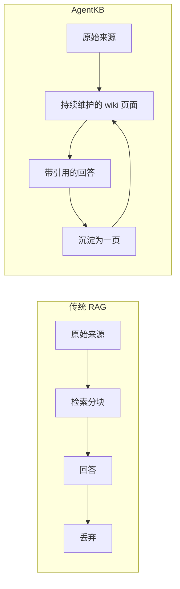
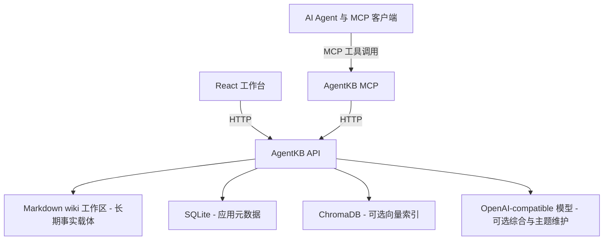

# Agent Knowledge Base (AgentKB)

> 面向 AI Agent 的本地优先、Git 友好的 Markdown 知识库。

[English](README.md) · **中文**

<!-- 英文原稿是 README.md；修改其一时请同步另一份。 -->

Agent Knowledge Base（简称 AgentKB）把原始来源变成一套可链接、可审阅、可复用的知识库。每个知识库都是一个纯 Markdown 工作区，包含不可变的来源快照、被持续维护的页面、索引和活动日志。网页工作台与 MCP Server 把同一套工作流同时提供给人和 Agent。

AgentKB 目前是 alpha 阶段的知识库工作台。摄取、检索和结晶都不依赖模型即可运行。可选的 OpenAI-compatible 接入负责启发式规则做不到的部分：把新来源归入它真正所属的主题页、让那一页的演化综合保持最新、并写出带引用依据的答案。需要人工复核的页面提案、流式输出、后台摄取队列和内容级 lint 仍在计划之中。

## 为什么需要 AgentKB



差别在于回答写完之后发生了什么。摄取把来源编译成持续维护的页面；查询从这些页面作答；而值得留下的回答会被归档成新的一页，于是下一次查询的起点比上一次更高。

Markdown 工作区是长期的事实载体。SQLite 保存应用元数据，ChromaDB 只是可选的检索加速层，而不是知识唯一存在的地方。

## 当前可用的能力

- 每个知识库各自拥有一个本地 Markdown 工作区。
- `raw/sources/` 下不可变的来源快照。
- 来源页、主题页、`index.md` 与仅追加的 `log.md`。
- 主题页会累积来源；配置模型后 `## Evolving synthesis` 段由模型维护，而归页判断与来源列表保持确定性。
- 用于浏览和编辑 Markdown 页面的 React 工作台。
- 同一工作区上的三个画布视图：页面本身、由 `[[wikilinks]]` 派生的链接图谱、以及可为断链一键补页的健康检查。
- 页面查询与原始资料查询都可选接入 OpenAI-compatible 模型综合，带引用依据，并在模型不可用时确定性回落。
- 页面查询会沿 `[[wikilinks]]` 从命中页面再扩展一跳，并把扩展结果标记为 `related`。
- wiki lint：断链、孤立页、缺少摘要。
- 每个回答下方可以点赞或贬低，贬低时可附原因。反馈是 SQLite 里的业务数据，绝不写入 wiki。
- 面向来源摄取、页面浏览、检索优先查询、状态、lint 与显式可选综合的 MCP 工具。
- 可选的 ChromaDB 与多语言 embedding 检索，同时服务于普通文档与可追溯的外部来源快照。

当前产品截图保存在 `demo/`，展示工作台、带引用的页面优先查询、派生链接图谱，以及可选的原始资料 RAG 模式。

交互式来源适配器接受文本与 `.txt` 文件。本地 JSON/JSONL 快照导入脚本也接受外部采集的 X、小红书或网页来源正文，而不给 Backend 引入浏览器登录依赖。PDF、DOCX 与直接 URL 抓取是接下来的输入格式。

## 架构



## 演示

页面优先查询：在 wiki 页面上做确定性 token 匹配，沿页面链接扩展一跳，并给出可回溯到 Markdown 路径的编号引用列表。配置模型后，同一批证据会产出带引用的模型答案。


派生链接图谱。结构完全来自 `[[wikilinks]]`，所以一个「index 链接到所有页面、主题页只链回自己的来源」的工作区就会长成下面这种星形——横向链接会在主题页开始跨来源综合之后出现。


当答案需要底层素材而不是被维护的页面时，原始资料 RAG 依然可用。每个片段都保留来源元数据，命中可以回溯到快照：


## 仓库结构

```text
backend/       FastAPI API 服务
frontend/      React + Vite + TypeScript 工作台
mcp-server/    面向 AI Agent 的 MCP 适配层
docs/          安装与项目设计文档
AGENTS.md      面向贡献者与编码 Agent 的开发指南
```

文档按用途拆分：[docs/ARCHITECTURE.md](docs/ARCHITECTURE.md) 定义实现设计、数据归属、模型配置优先级与查询契约；[docs/LOCAL_INSTALLATION.md](docs/LOCAL_INSTALLATION.md) 覆盖部署；[llm-wiki.md](llm-wiki.md) 仍是 Markdown 优先方法论的原始来源。

## 快速开始

### Backend

```bash
cd backend
python -m venv .venv
source .venv/bin/activate
pip install -r requirements.txt
cp .env.example .env
uvicorn app.main:app --reload --host 127.0.0.1 --port 8000
```

Windows 下用 `.venv\Scripts\activate` 激活环境，用 `copy .env.example .env` 复制配置文件。

API 与 OpenAPI 文档地址：

```text
http://localhost:8000
http://localhost:8000/docs
```

### 工作台

在另一个终端：

```bash
cd frontend
npm install
npm run dev
```

打开 `http://localhost:5173`，创建知识库、摄取一份来源、浏览生成的 Markdown 页面。画布可以在页面、派生链接图谱与健康检查之间切换；阅读区始终显示当前页面的出链、反向链接和未解析链接。

### 导入外部来源快照

外部平台采集刻意与 Backend 分离。请使用已登录的只读采集工具（例如 OpenCLI 或其他经批准的工具），保存成本地 JSON/JSONL 文件，再用仓库脚本导入：

```bash
cd backend
PYTHONPATH=. python scripts/import_source_snapshots.py \
  --knowledge-base-id 1 \
  --input /path/to/source-snapshots.json
```

每条记录包含 `title`、`content`、`source_url`、`platform`、可选的作者/账号与时间戳、`source_policy`（`full_text`、`excerpt` 或 `link_only`）、披露信息和标签。对 `full_text` 记录，所提供的确切正文会写入 SQLite 的 `documents.content`、`raw/sources/`，以及用于构建 Chroma 的分块记录。导入脚本用来源 URL 加内容哈希在重复执行时跳过完全相同的记录。

完整的第三方正文属于本地运行时数据（`data/` 与 `WIKI_ROOT_DIR`），本仓库不公开这些内容。不要用摘要补写无法访问的原文；应当如实标记为 `excerpt` 或 `link_only`。

### 可选的模型综合

AgentKB 默认运行在确定性本地模式。要从任意 OpenAI-compatible 服务获得带引用依据的答案，请在启动 Backend 前编辑 `backend/.env`：

```dotenv
LLM_ENABLED=true
LLM_BASE_URL=https://api.openai.com/v1
LLM_API_KEY=your-api-key
LLM_MODEL=gpt-4o-mini
LLM_TEMPERATURE=0.2
LLM_MAX_TOKENS=1200
LLM_TIMEOUT_SECONDS=60
```

服务端发送标准的 `POST {LLM_BASE_URL}/chat/completions` 请求。使用兼容网关或本地服务时，替换服务地址与模型名即可。在工作台里用 **配置模型** 设置或临时覆盖正在运行的 Backend 配置，并测试连接。网页端提供的配置只存在于当前 Backend 进程；重启后恢复 `.env` 中的值。API Key 不会被 API 返回，也不会写入 wiki、SQLite 或浏览器持久化存储。

启用模型综合后，两种查询模式都会保留各自的检索证据，并返回简洁的带引用答案。如果模型被关闭、配置不完整或不可用，AgentKB 会保留当前的确定性页面答案或原始检索结果，并在结果面板里说明回落原因。

启用模型同时会打开**摄取时的主题维护**。摄取总是先在不使用模型的情况下写好来源页及其来源列表；随后由模型挑选这条来源所属的主题页（或新建一页），并重写该页的 `## Evolving synthesis`。在启用之前，有两件事值得了解：

- 每次摄取都会多花一次模型调用，并且摄取会等待它。主题维护在数据库事务提交之后执行，所以模型慢或失败既不会阻塞、也不会回滚摄取本身，失败只会记录在 `log.md` 里。
- 模型可以在 Backend 给出的候选主题页之间选择，也可以要求新建一页。它无法自行创建、重命名或搬移文件，也从不拥有 `sources:` 列表或 `## Sources` 段。

如果希望在已配置模型的情况下仍让某次摄取完全确定性，请在 `documents/text` 或 `documents/source-snapshot` 请求里传 `"synthesize_topic": false`。MCP 的摄取工具始终这样传。

### 查询行为

页面优先查询（`POST /api/knowledge-bases/{id}/wiki/query`）：

1. 对 `wiki/` 下每个页面做确定性 token 打分。
2. 沿页面自身的链接扩展一跳：命中页面的出链与反向链接页面作为补充证据加入结果，按「被多少个命中页面连到」排序，上限由 `WIKI_QUERY_NEIGHBOUR_LIMIT` 控制（默认 3，设为 0 可关闭）。这些页面带有 `related: true`，并且始终排在直接命中之后。
3. 确定性回答与结晶到 `wiki/queries/` 的页面只使用直接命中；模型可以把这些关联页面当作额外上下文，它们在证据里被标注为 linked page。

原始资料 RAG（`POST /api/search`）作用在分块上：对 `document_chunks` 做 embedding 并按知识库过滤，同样支持可选的模型综合与相同的确定性回落。

### MCP Server

在 Backend 运行的前提下：

```bash
cd mcp-server
python -m venv .venv
source .venv/bin/activate
pip install -r requirements.txt
python server.py
```

客户端配置示例：

```json
{
  "mcpServers": {
    "agentkb": {
      "command": "python",
      "args": ["mcp-server/server.py"],
      "env": {
        "BACKEND_API_URL": "http://127.0.0.1:8000",
        "BACKEND_TIMEOUT_SECONDS": "10"
      }
    }
  }
}
```

MCP 被设计为外部 Agent 的知识基础设施：`query_wiki` 与 `search_knowledge_base` 始终返回本地检索证据，即使工作台模型已启用也不会调用 AgentKB 的模型。调用方 Agent 通常应当用自己的模型完成最终综合。只有调用方明确希望由 Backend 配置的模型产出带引用依据的答案时，才使用 `synthesize_knowledge`。摄取工具会传 `synthesize_topic: false`，因此由 MCP 触发的摄取绝不会用 Backend 模型改写主题页。wiki 查询结果可能包含沿链接到达的页面（`related: true`），应把它们当作支撑性上下文而不是直接命中。其他 MCP 工具包括 `add_source_to_wiki`、`read_wiki_page`、`list_wiki_pages`、`get_wiki_status` 与 `lint_wiki`。较旧的 `add_text_document` 仍保留以兼容旧调用。

## Wiki 工作区

每个知识库在 `WIKI_ROOT_DIR` 下拥有独立工作区：

```text
kb-1/
├── .wiki-schema.md       # 页面、链接与维护约定
├── purpose.md            # 研究目标与关键问题
├── raw/sources/          # 不可变的来源快照
├── wiki/
│   ├── overview.md
│   ├── sources/          # 来源摘要页
│   ├── topics/           # 演化中的主题页
│   ├── entities/         # 预留给实体页
│   └── queries/          # 保存下来的查询结晶
├── index.md              # 生成的导航索引
└── log.md                # 仅追加的活动日志
```

页面之间用 `[[wikilinks]]` 互相链接。图谱数据由这些链接派生，永不被当作独立的事实来源。

`purpose.md` 是整个工作区唯一「讲述自己为什么存在」的页面。它会作为上下文（而非引用）传给模型，用于查询综合与主题维护，使模型能依据工作区的意图、而不只是问题本身来判断相关性。

## 开发

Backend 与 MCP 的测试使用 pytest，前端用 Vite 做类型检查与打包。

```bash
cd backend
PYTHONPATH=. python -m pytest -q
python -m compileall app

cd ../mcp-server
PYTHONPATH=. python -m pytest -q

cd ../frontend
npm run build
```

完整的本地环境配置见 [docs/LOCAL_INSTALLATION.md](docs/LOCAL_INSTALLATION.md)。

## 路线图

接下来的步骤，大致按单位工作量的价值排序：

1. 解决大工作区下图谱布局的 O(n²) 问题：减少迭代次数并用 Barnes-Hut 近似，或把布局放进 Web Worker。
2. 对中文查询/token 做分词，而不是子串匹配，让页面优先检索不再漏掉同义表达。
3. 把摄取移入带进度、重试与内容哈希去重的后台队列；目前摄取会阻塞请求，重复摄取未变化的来源会产生第二条记录。
4. 增加内容级 lint：页面之间的矛盾、被更新来源取代的结论、以及被提到却没有独立页面的概念。
5. 抽出独立的 `wiki-core` 包承载工作区格式与 Markdown 操作，并加入可复核的页面提案与流式综合。
6. 增加冲突检测、Git 同步、更多 provider 适配，并把工作区格式稳定为 version 1。

## 项目状态与命名

公开产品名是 `Agent Knowledge Base`，`AgentKB` 是它在产品、包名、MCP 与仓库层面的简称。本地检出目录与预期的公开仓库 slug 是 `agentkb`。这个名字直接描述产品：一个人和 AI Agent 都能维护与查询的知识库。现有 API 路径与环境变量名保持稳定。使用 `kk_knowledge.db` 或 `livingwiki.db` 的本地安装，应在启动改名后的检出之前运行 `python backend/scripts/migrate_storage_names.py`；详见 [docs/LOCAL_INSTALLATION.md](docs/LOCAL_INSTALLATION.md)。

本项目受 [`llm-wiki.md`](llm-wiki.md) 中描述的 living-wiki 工作流启发。未来若复用外部项目的代码、模板或文字，必须保留其许可与署名。

## 许可

AgentKB 以 [MIT License](LICENSE) 发布。

欢迎贡献。提交 PR 前请先阅读 [CONTRIBUTING.md](CONTRIBUTING.md)。
